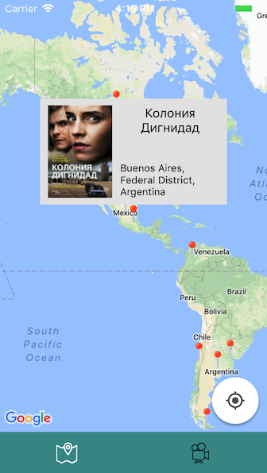
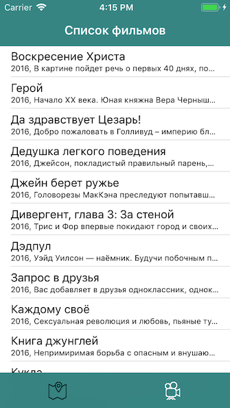

# Movie Markers App

This is an example project to demonstrate:
* [VIPER](https://github.com/strongself/The-Book-of-VIPER) architecture
* [Typhoon](https://github.com/appsquickly/Typhoon/)
* [Google maps](https://developers.google.com/maps/ios/) with ads
* Service Oriented Architecture
* Usefull utils as AppDelegateProxy, Nimbus etc. 

in a simple movie markers app that lists film markers information on map. With movie feed and detail information. 

 

## Requirements

- Xcode 8 or later
- [CocoaPods](https://cocoapods.org) 1.1.0 or later

## Setup

1. Download the source code or clone the repository.
2. Run `pod install`.
3. Get a free API key from [Google maps](https://developers.google.com/maps/documentation/ios-sdk/get-api-key).
4. Open `ApplicationConfiguratorImplementation.m` and fill `MP_GOOGLE_KEY = ""` with your own API key.

## License

MIT license. See the `LICENSE` file for details.
